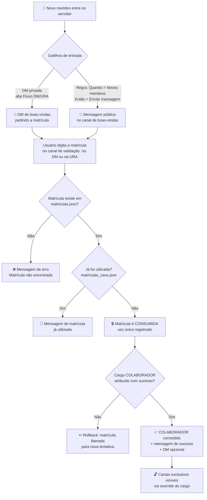
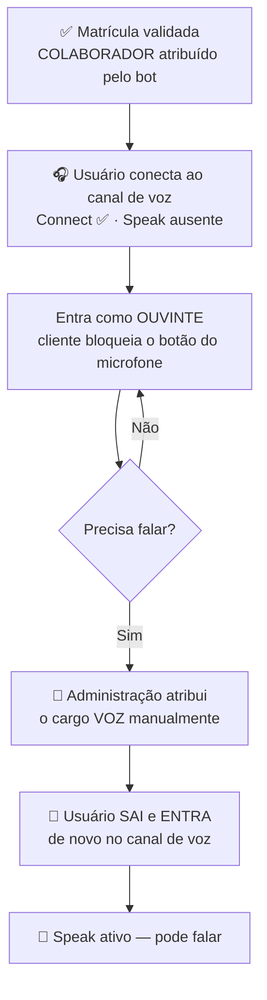

# Fluxos de Permissão de Acesso — Canal de Texto e Canal de Voz

Este documento descreve, de ponta a ponta, **como um usuário ganha acesso** aos canais de texto e à fala nos canais de voz do servidor Stoat, combinando as permissões da plataforma com a automação do **FlexBot**.

> 📚 Detalhes técnicos profundos (bits de permissão, código do calculador, limitações da API) estão em [`system_limitations.md`](./system_limitations.md) §4. Este doc é o **mapa do fluxo** — o que acontece, em que ordem e o que configurar.

---

## 🧩 1. Os Cargos do Modelo

| Cargo | Quem atribui | Função no fluxo |
|---|---|---|
| `@everyone` (padrão) | — | Estado inicial: vê apenas os canais públicos de entrada |
| **COLABORADOR** | 🤖 FlexBot, após validar a matrícula | Libera os canais de texto exclusivos e a **entrada** (escuta) na voz |
| **VOZ** | 👤 Administração, manualmente | Habilita a **fala** no canal de voz, por cima do COLABORADOR |
| **Cargo do FlexBot** | — | Precisa de `AssignRoles`, `SendMessage`, `ManageMessages` e ficar **acima** dos cargos que atribui |

### A regra de ouro do Stoat: o último cargo vence

O Stoat calcula permissões aplicando os cargos **do rank maior para o menor** — o cargo de rank **menor** (mais acima na lista) é aplicado **por último e prevalece**, seja allow ou deny. Não funciona como o Discord, onde deny costuma ganhar.

Consequências práticas para este modelo:

1. **Nunca use *deny* de `Speak` no COLABORADOR** — deixe o campo em branco (não concedido ≠ negado).
2. **Posicione VOZ acima de COLABORADOR** na lista de cargos.
3. Defina cada permissão em **um nível só** (servidor *ou* override do canal), nunca nos dois.

---

## 📄 2. Fluxo de Acesso ao Canal de Texto

### 2.1 Montagem das permissões dos canais

| Canal | `@everyone` | COLABORADOR |
|---|---|---|
| **#boas-vindas / #validação** (público) | `ViewChannel` ✅ · `SendMessage` ✅ | — (herda) |
| **Canais exclusivos** | `ViewChannel` ❌ (deny no override do canal) | `ViewChannel` ✅ · `SendMessage` ✅ (allow no override do canal) |

> ⚠️ Como COLABORADOR precisa **sobrepor** o deny do `@everyone` nos canais exclusivos, o allow deve estar no override de canal do cargo COLABORADOR — e o COLABORADOR deve estar **acima** do cargo padrão na ordem de aplicação (o que sempre é verdade, pois `@everyone`/default é a base do cálculo, aplicada antes dos cargos).

### 2.2 O fluxo completo

### 2.3 Regras de negócio embutidas

- **Uso único**: cada matrícula libera acesso **uma vez**. A checagem e o consumo acontecem na mesma operação (`consumirMatricula`), o que impede duas validações simultâneas da mesma matrícula. Reutilização responde com a mensagem configurável de "já utilizada".
- **Rollback automático**: se a matrícula é válida mas o Stoat recusa a atribuição do cargo (permissão/hierarquia), o consumo é desfeito — um erro transitório não queima a matrícula.
- **Liberação administrativa**: pelo painel (badge **Utilizada** → botão **Liberar**, ou **Liberar Selecionadas**), ou via `POST /api/matriculas/:numero/liberar`.
- **Higiene do canal público**: a mensagem com a matrícula digitada é apagada (`ManageMessages`) e as respostas do bot se auto-deletam após `deleteDelaySeconds`.

### 2.4 Onde configurar

| O quê | Onde |
|---|---|
| Regra de validação (Quando = Validar matrícula) | Painel → **Fluxo de Validação no Canal** → 3 passos |
| Boas-vindas públicas (Quando = Novos membros) | Mesmo wizard, gatilho "Novos membros do servidor" |
| DM de boas-vindas (1º ingresso) | Painel → **Fluxo DM/URA** → Passo 1 |
| Base de matrículas e status de uso | Painel → **Base de Matrículas** |

---

## 🎙️ 3. Fluxo de Permissão de Acesso à Voz

### 3.1 O modelo de dois cargos

A matrícula dá **acesso** (entrar e ouvir). A **fala** é um privilégio separado, concedido manualmente:

| Cargo | `Connect` (entrar/ouvir) | `Speak` (falar) |
|---|---|---|
| **COLABORADOR** | ✅ permitido | ⬜ **em branco** — não concedido e **não negado** |
| **VOZ** | — (herda) | ✅ permitido |

Configure ambos no **override do canal de voz** (não nas permissões globais do servidor).

### 3.2 O fluxo completo

### 3.3 Os três avisos que evitam chamados de suporte

1. **A permissão de voz é avaliada na CONEXÃO.** Quem já está no canal quando um cargo/permissão muda permanece com o estado antigo — e com o botão do microfone travado — até **sair e reconectar**. Não há correção por configuração; é o comportamento da plataforma.
2. **O estado do microfone ao entrar (ligado/mutado) é do CLIENTE.** Cada pessoa reabre com o último estado que usou na própria máquina. Não existe "entrar sempre mutado" configurado pelo servidor no Stoat.
3. **Um deny escondido derrota o cargo VOZ.** Se qualquer cargo com rank **menor** que o VOZ negar `Speak` (inclusive um deny herdado no cargo padrão), o deny é aplicado depois e vence. Sintoma clássico: "dei o cargo VOZ e a pessoa continua muda". Verificação: ordem dos cargos + nenhum deny de `Speak` em lugar nenhum.

### 3.4 O que o FlexBot faz — e o que ele não faz — na voz

| | Situação |
|---|---|
| ✅ O bot **entrega o COLABORADOR** | Isso já habilita a entrada na voz via override do canal |
| ✅ O merge de cargos **preserva o VOZ** | `assignRoleToUser` mescla a lista (`[...atuais, novo]`) — conceder COLABORADOR nunca apaga o VOZ de quem já tem |
| ❌ O bot **não reage a eventos de voz** | O `stoat.js` 7.3.6 não reemite `VoiceChannelJoin`/`Leave` (marcados como `// todo` no upstream) — impossível auto-mutar na entrada |
| ❌ O bot **não usa mute de servidor** | Os campos `can_publish`/`can_receive` existem na API, mas o projeto optou pelo modelo de dois cargos (ver `system_limitations.md` §4.3) |

---

## 🛠️ 4. Solução de Problemas (Sintoma → Causa → Correção)

| Sintoma | Causa provável | Correção |
|---|---|---|
| Validou a matrícula mas não vê os canais exclusivos | Override de `ViewChannel` do COLABORADOR ausente no canal | Adicionar allow de `ViewChannel`/`SendMessage` no override do canal para COLABORADOR |
| "Matrícula não encontrada" para matrícula que existe | Ela já foi consumida (a mensagem certa seria "já utilizada" — confira a regra) ou há espaço/erro de digitação | Painel → Base de Matrículas → conferir badge **Utilizada** → **Liberar** se for o caso |
| Bot valida mas o cargo não vem | Cargo do bot sem `AssignRoles` ou abaixo do COLABORADOR na hierarquia | Subir o cargo do bot; a matrícula **não foi queimada** (rollback automático) — basta reenviar |
| Deu o cargo VOZ e a pessoa continua muda | (a) não reconectou ao canal; (b) deny de `Speak` em cargo acima do VOZ | (a) sair e entrar na voz; (b) remover o deny e deixar `Speak` em branco no COLABORADOR |
| Pessoa entra na voz já com microfone aberto | Estado do cliente (último uso na máquina dela) | Comportamento da plataforma — sem `Speak` ela não transmite, mesmo com o botão "ligado" |
| Ninguém consegue nem entrar na voz | `Connect` não concedido (ou negado) no override do canal | Allow de `Connect` para COLABORADOR no canal de voz |

---

> 📌 Documento alinhado ao **stoat.js 7.3.6** / **stoat-api 0.8.9-4** (agosto/2026). As permissões citadas (`ViewChannel` 2²⁰, `SendMessage` 2²², `Connect` 2³⁰, `Speak` 2³¹) foram conferidas em `node_modules/stoat.js/lib/permissions/definitions.js`.
