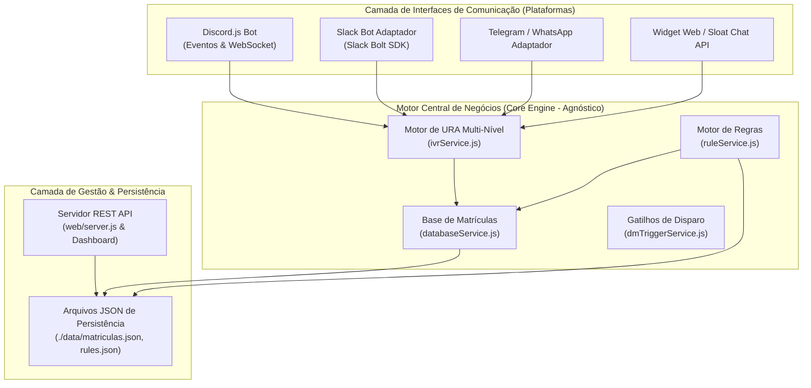

# Arquitetura do FlexBot & Guia de Integração Multi-Plataforma (Slack, Telegram, Web Widgets)

Este documento detalha a arquitetura interna do **FlexBot**, como seus módulos de validação de matrícula e URA funcionam e como ele pode ser reutilizado/adaptado para outras ferramentas de comunicação (como **Slack**, **Telegram**, **WhatsApp**, ou widgets de atendimento como **Sloat**).

---

## 🏛️ 1. Visão Geral da Arquitetura (Decoupled Engine)

O FlexBot foi desenvolvido com uma **Arquitetura Desacoplada** em camadas independentes. A lógica de negócios, validação de matrículas e árvore de URA **não dependem do Discord**. O Discord atua apenas como uma *interface de transporte*.



---

## 🧩 2. Como Funciona Cada Módulo do Bot

### 1. Base Oficial de Matrículas (`services/databaseService.js`)
- **Função**: Armazena e valida códigos numéricos corporativos em tempo real.
- **Formato**: JSON persistente (`data/matriculas.json`) com buscas otimizadas em memória (`Set` / `Array.includes`).
- **Recursos**: Adição individual, importação em massa (CSV/texto) e busca instantânea.

### 2. Motor de URA Multi-Nível (`services/ivrService.js` & `dmRuleService.js`)
- **Função**: Gerencia a árvore de menus interativos privados por sessão de usuário.
- **Controle de Estado**: Mantém em memória a etapa atual do atendimento de cada usuário (`ROOT`, `SUBMENU`, `AWAITING_MATRICULA`).
- **Consequências Combináveis (E/OU)**: Cada opção pode disparar:
  - 💬 **Enviar Mensagem**: Texto informativo ou link de canal.
  - 🏷️ **Conceder Cargo / Tag**: Atribuição de permissão corporativa.
  - 🎓 **Solicitar Matrícula**: Valida o código numérico na base oficial.
  - 🌳 **Abrir Submenu**: Navegação em níveis secundários de opções.

### 3. Motor de Regras e Canais (`services/ruleService.js`)
- **Função**: Filtra mensagens enviadas em canais públicos ou privados.
- **Recursos**:
  - Filtro por canal autorizado (ex: `#validação`).
  - Tempo de auto-deleção da resposta (`deleteDelaySeconds`).
  - Template de mensagens dinâmicas com substituição de tags (`{user}`, `{server}`, `{role}`).

### 4. Servidor REST API e Dashboard Web (`web/server.js`)
- **Função**: Expõe endpoints RESTful HTTP em Express para que qualquer painel web ou sistema externo liste, adicione e gerencie as regras e matrículas.

---

## 🚀 3. Podemos usar o FlexBot em outras ferramentas (ex: Sloat, Slack, Telegram)?

### **SIM, 100%!**

Como a lógica do bot está **desacoplada**, para migrar ou estender o FlexBot para outra ferramenta (como o Sloat, Slack ou Telegram), **você só precisa criar um pequeno arquivo adaptador de plataforma** que escuta as mensagens da nova ferramenta e chama os mesmos módulos centrais (`ivrService.js` e `databaseService.js`).

---

### 📋 Exemplo Prático de Adaptação para Outras Plataformas:

#### A. Para a plataforma **Sloat / Web Chat**:
O Sloat ou qualquer widget web costuma enviar mensagens via webhook HTTP (JSON POST). Para integrá-lo:
```javascript
// Exemplo de rota no web/server.js para o Sloat Chat Widget
app.post('/api/sloat/message', async (req, res) => {
  const { userId, text } = req.body; // Mensagem recebida do Sloat
  
  // Executa exatamente o mesmo motor de URA e Matrículas!
  const reply = await ivrService.processGenericMessage(userId, text);
  
  res.json({ replyMessage: reply });
});
```

#### B. Para a plataforma **Slack**:
Basta instalar o pacote oficial `@slack/bolt` e conectar as mensagens recebidas:
```javascript
const { App } = require('@slack/bolt');
const ivrService = require('./services/ivrService');

const slackApp = new App({ token: process.env.SLACK_BOT_TOKEN, signingSecret: process.env.SLACK_SIGNING_SECRET });

slackApp.message(async ({ message, say }) => {
  // Processa a validação usando o mesmo banco de matrículas!
  const isMatch = databaseService.validarMatricula(message.text);
  if (isMatch) {
    await say(`✅ Matrícula ${message.text} validada no Slack!`);
  }
});
```

#### C. Para **Telegram** (via Telegraf SDK) ou **WhatsApp**:
O mesmo principio se aplica: recebe a mensagem do usuário do Telegram/WhatsApp, chama `databaseService.validarMatricula(texto)` ou `ivrService.processIVRMessage()` e retorna a resposta.

---

## 💡 Resumo das Vantagens da Estrutura

1. **Reaproveitamento Total de Código**: Você não precisa reescrever a validação de matrículas nem as regras da URA ao mudar de chat.
2. **Base Única de Dados**: O arquivo `matriculas.json` e o Dashboard Web continuarão sendo a fonte da verdade para **todas as plataformas simultaneamente**.
3. **Escalabilidade**: Permite rodar o bot no Discord, Slack e Sloat ao mesmo tempo compartilhando as mesmas regras corporativas!
